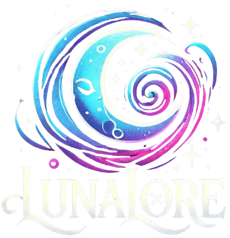

# LunaLore - Crafting Cosmic Stories for VTubers


</img>
## About

LunaLore is a cosmic-themed platform designed specifically for VTubers who want to bring their characters to life with rich backstories, interactive lore, and immersive storytelling. LunaLore offers an innovative suite of tools that help VTubers craft and manage their character lore, engage with their audiences, and create a unique universe for their fans to explore.

## Features
- **Character Profiles**: Build detailed character profiles with customizable lore elements.
- **Viewer Interaction**: Let audiences vote on story arcs, submit lore ideas, and engage with the character’s universe in real-time.
- **AI-Powered Tools**: Use AI prompts for character development and storytelling ideas.
- **Social Media Integration**: Tweet as your character to keep fans engaged between streams.
- **Plugin Marketplace**: Enable custom plugins to expand LunaLore’s capabilities, tailored to each VTuber's needs.

## Installation

Clone the repository:
```sh
$ git clone https://github.com/yourusername/lunalore.git
```

Navigate to the project directory:
```sh
$ cd lunalore
```

Install the dependencies:
```sh
$ npm install
```

Run the application:
```sh
$ npm start
```

## Development

To run the app in development mode:
```sh
$ npm run dev
```

## Build

To package the Electron app for distribution:
```sh
$ npm run build
```

## Contributing

Feel free to fork this repository, make improvements, and submit a pull request. Contributions are always welcome!

## License

This project is licensed under the MIT License. See the [LICENSE](LICENSE) file for more details.

## Contact

For more information, contact [Your Name](mailto:youremail@example.com).

## Acknowledgments

- Icon artwork by ChatGPT.
- Built with Electron and other amazing open source tools.
